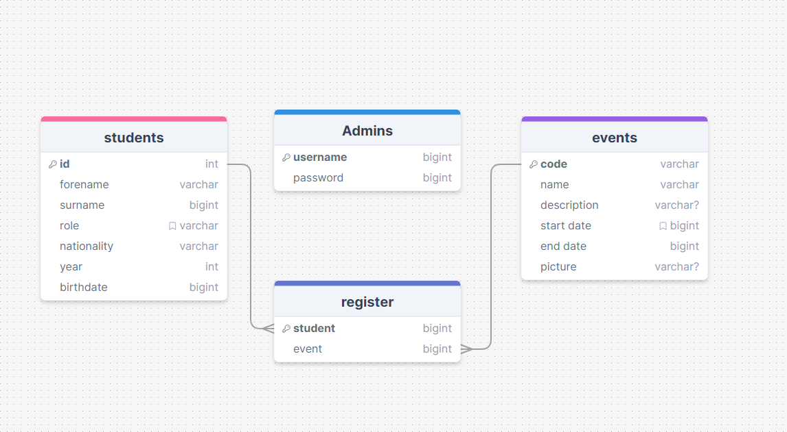

# Development of a Database-Linked Website for NCEA Level 2

Project Name: **International Events Register System**

Project Author: **Jess Lerch**

Assessment Standards: **91892** and **91893**

-------------------------------------------------

## Design, Development and Testing Log

### DATE HERE

Replace this test with what you are working on

Replace this text with brief notes describing what you worked on, any decisions you made, any changes to designs, etc. Add screenshots / links to other media to illustrate your notes where necessary.

snapshot of smt V.1

I showed this to ... and got their feed back

>quote what they say like this

I made some changes and here is V.2

### 20/05/2024

Worked on flow and database design

Flow Version 1:

Problem I'm facing is to figure out how admin portal will work.
Also I have to figure out how the students can cancel/undo sign-ups without the risk of getting impersonated. I'm thinking of making the student enter their school password when they signed-up and undo but not sure if that's a good idea or not.

Database Version 1:

There's 2 and tables and 1 linking table to get data of signed up students. Have to check if the information of the student and event table are enough or too much.

I will need to get feedback from my end-user about both the flow and the DB. I also have to ask them of their preferred color pallete.

### 21/05/2024

I asked about how admin portal would looked like and added it to drawsql. I also change 'id' column of events table into 'code' as an events could repeat my times during school year. 

Database Version 2:

Added a table with admin username and password that will be used by international staffs and leaders.

### 23/05/2024

On the 21/05/2024 after school I have discussed with my client about the progress I have done so far and got some feedback.

My client said that it would be a good idea to add a page where a student could view all their sign ups and manage it there for easier usage. To do that and preventing impersonation we have decided that we should make the system have a log in function.
>Everyone should know their school password and it wouldn't be too hard to use eventhough they have to log in.

is what my client said.

I think that a log in function would be very nice. However, one problem I can think of is that what if somehow a student haven't been register into the system then what will happen. I don't think it would be much of a problem though as I could add a form to register that will need admin approval before it can updated into the database. Otherwise the student could talk to international staff and we can add the student in.

My client have approved my database tables and also provided my with the color pallette that they would like the system. (add pic)

I would need to redesign my user flow to have sign-in function that will differ in the access within the system between students and admin.
### 27/05/24

I'm working on the new verstion of my user flow, however I have come across some confusing aspect of the system. My user suggest that I add a page that have a list of all the sign ups that a student have done. I'm just confused on what would happened when the sign up period ends..? would the sign up be gone from the 'My sign ups' page or would it be gray and uninteractable. If then when will the gray sign up be gone? Or perhaps I should add a section called passed events signups where it all go there after the event has ended? I would need to have a discussion with my end user.

User Flow Version 1:

### 10/06/24

I had a conversation and I have come to the conclusion that the log in system is too complicated for my level 2 demo system, therefore I'll will be using a PIN as a security factor to prevent impersonation of students, and here is my database and flow that have been edited.

Replace this text with brief notes describing what you worked on, any decisions you made, any changes to designs, etc. Add screenshots / links to other media to illustrate your notes where necessary.

### DATE HERE

Replace this test with what you are working on

Replace this text with brief notes describing what you worked on, any decisions you made, any changes to designs, etc. Add screenshots / links to other media to illustrate your notes where necessary.

### DATE HERE

Replace this test with what you are working on

Replace this text with brief notes describing what you worked on, any decisions you made, any changes to designs, etc. Add screenshots / links to other media to illustrate your notes where necessary.

### DATE HERE

Replace this test with what you are working on

Replace this text with brief notes describing what you worked on, any decisions you made, any changes to designs, etc. Add screenshots / links to other media to illustrate your notes where necessary.

### DATE HERE

Replace this test with what you are working on

Replace this text with brief notes describing what you worked on, any decisions you made, any changes to designs, etc. Add screenshots / links to other media to illustrate your notes where necessary.