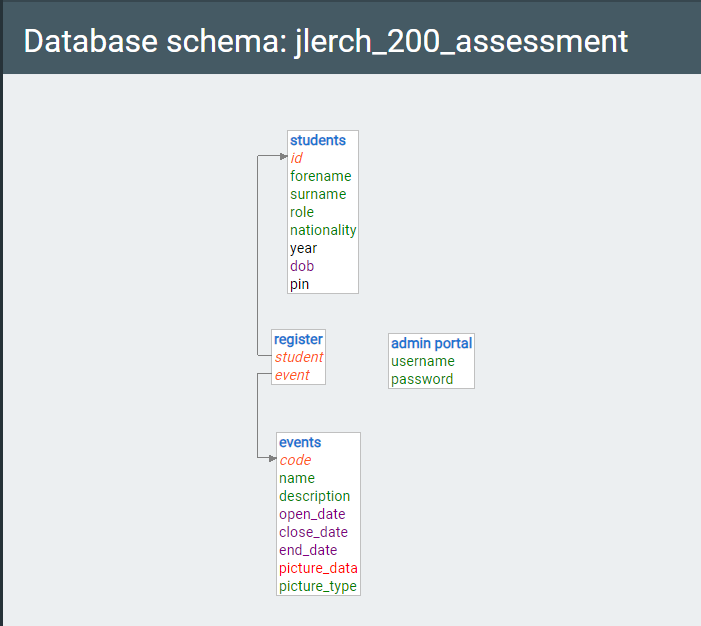
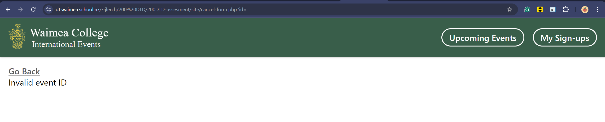

# The Design of a Database-Linked Website for NCEA Level 2

Project Name: **International Events Register System**

Project Author: **Jess Lerch**

Assessment Standards: **91892** and **91893**

-------------------------------------------------

## System Requirements

### Identified Need or Problem

The client I am working with in this project is the International Department. This project is aim to reduce the inconvenient that the international department faced when organizing extra curricular events. Sometimes the students handwriting are hard to read and identify who is signed up, and who are coming. With this project I want to give the international staffs and leaders an easier time planning and organizing events.

### End-User Requirements

This will work as a multi-user system by my 2 main groups of end-user which are:

- **The International Leaders/Staffs** are involved in organizing events. In order to efficiently planned the equipment needed they would need to be able to clearly see a list of the students that are coming to the upcoming events.

- **The International Students** including migrants, would likely want to know the upcoming events easily without the need to only go to school and look at the international notice board. With this system they will be able to look out for upcoming events in the site and make themselves free for the day and sign up!

### Proposed Solution

A website that allows *international staffs/leaders* to add upcoming events and view a list of student names who have signed up to come.

The website will also allows *international students and migrants* to easily browse around the site and view upcoming events, past events, and signed up to upcoming events to let the staffs and leaders know that they are coming.

The international staffs/leaders (The admins) should be able to:
- log in through admin portal access password
- view upcoming and past events
- be able to set up a new upcoming event with a starting/closing date for signing up
- Leaders should also sign up like the students
- be able to view a list of students who are coming in a clear neat table
- be able to update the events starting/closing sign up date or description incase anything changes
- view a list of all the international and migrant students with all information i.e. DoB, nationality, forename, surname

The international students should be able to:
- view upcoming and past events
- click on a button to sign up for events they think they are coming
- click on event element and view greater details such as pictures and more descriptions in a separate page
- undo sign in incase their plans changes
- be able to submit a form of student info if their name is not yet in the database that will need to get approve by an admin before it can get updated on the server
- be able to view a list of all international and migrant students forename and lastname

-------------------------------------------------

## Relevant Implications

### Usability

The usability implications of a digital technology or digital outcome (e.g. a website) relate to how easy it is to use for the end-user, without the need for help or guidance.

*When you create a digital technologies outcome, you should ask...*

- Does it follow common usability heuristics
- Can the end-user complete tasks / actions easily, with little need for help?

*When you create a digital technologies outcome, you should try to...*

- Follow standard conventions (e.g. placement of menus, etc.)
- Make the behaviour of the outcome logical and familiar
- Provide the end-user with a clear route forwards (and back out, if needed)
- Always make it obvious to the end-user what is happening
- (See the usability heuristics for others)
<!-- Replace this text with a clear explanation of what the implication means. -->

**Why is this relevant to this project?**  
I need to design my system to be as easy to use as I can as the end-user for this project came from all around the world with different english and IT background. I have to make sure that the  interface is easy to understand, and will be usable for everyone even if they are not good with IT.
<!-- Replace this text with an explanation of why the implication is relevant to this particular project. -->

As I design my system’s UI, I will refer to Nielsen’s heuristics and try to make sure that the UI meets them as far as possible. Specifically, I will aim for my website to have the same UI design throughout the pages with good consistency and follow other website convensions so that it is easy for people to catch on how to navigate around the website (Consistency and standards). Moreover, They should be able to arrange the events as they please like: order by A-Z, order by events register closing time, and so on for easy browsing (Flexibility and efficiency of use). The user should also have to ability to undo or cancle their sign ups incase they change their minds. The button to leave or way out of pages should also be easy to spot (User control and freedom). When registering into events they select their name from the list that will appear for them to select without the need to type out the whole name to prevent mispelling (Recognition rather than recall). 
Lastly, I will provide a help section/page that end-user could go to if they have trouble understanding the UI and how to sign up to events (Help and documentation).

<!-- Replace this text with an explanation of what you will need to consider moving forward and how the project will be impacted by this implication. -->To make sure that I have succeeded this I will need to test-out the system with my end-user and get feedback to improve my system.

### Functionality

The functionality implications of a digital technology or digital outcome (e.g. a website) relate to how well it works for the end-user, in terms of meeting its intended purpose.

*When you create a digital technologies outcome, you should ask...*

- Does it do everything it is supposed to, and meets its purpose?
- Is it bug-free and doesn't crash?
- Does is work as expected from the user's point-of-view?

*When you create a digital technologies outcome, you should try to...*

- Fully satisfy the original need / purpose
- Fully meet the user's requirements
- Make sure that it copes with all inputs (normal, boundary and abnormal)

<!-- Replace this text with a clear explanation of what the implication means. -->

**Why is this relevant to this project?**  
I will need to ensure that my system is bug-free and is functioning properly without constantly freezing or crashing. If there's somehow any error that has escaped out, the system should not show any long error message that user cannot comprehend. This implication is very vital as if it doesn't function it will not solve our initial problem and all the work put into the productio of the system will go to waste. Therefore, I need to do a lot of testing with my end-user to make sure that there is no loophole/deadend and everything will work nicely. 

<!-- Replace this text with an explanation of why the implication is relevant to this particular project. -->

<!-- have to paraphrase -->I will aim for my website to keep the end-user informed of what is going on, for example, when a student sign-up to an event they have already sign-up to, the system will tell that they have already signed-up to this event so that the user don't get confused and aware about system status. Also, closed events in student's my sign up page will turn gray and uninteractable.This is so that user knows that the website is working and did not freeze (Visibility of system status). I also have to ensure that my forms can recognize invalid inputs and prevents error that the end-user could mistakenly make, like for example if they forgot to type their pin for the sign-up.(Error prevention). Moreover, to make sure that my website will be fully functional and have no dead-end, I have to provide a feedback of how they can fix that error, for example, 'PIN should only be in numbers,' this will help user recognize their error and recover from it, which would also enhance my last point of trying to prevent.(users recognize, diagnose, and recover from errors).

<!-- Replace this text with an explanation of what you will need to consider moving forward and how the project will be impacted by this implication. -->

### Aesthetics

The aesthetic implications of a digital technology or digital outcome (e.g. a website) relate to how it looks in terms of design.

*When you create a digital technologies outcome, you should ask...*

- Does the design appeal to the end-users?
- Does the design follow conventions?
- Has good use been made of colour, font, positioning, etc.?

*When you create a digital technologies outcome, you should try to...*

- Create an overall design that appeals to the end-users
- Create an overall design that is suitable for the outcome's purpose
- Use colours that work effectively together to create a pleasing effect
- Use fonts that work well with the design and convey the appropriate 'feel'
- Position elements of the design in a way that is balanced
- Group / seperate elements to focus attention and/or link related items
<!-- Replace this text with a clear explanation of what the implication means. -->

**Why is this relevant to this project?**  
My system should have consistance pallete that will look asthetically pleasing to my end-users. I also have to think about colors that have good contrast to highlight parts that are meant to be seen or is important.

<!-- Replace this text with an explanation of why the implication is relevant to this particular project. -->Refering to Nielsen’s heuristics I will design my website to have good contrasting color that will appeal to my end-users. Also, keeping a consistance UI color and design that could be familiarize quickly by my end-users. Impoartant elements shouldn't be hard to spot or distracted by unessary elements (Aesthetic and Minimalist Design).
<!-- Replace this text with an explanation of what you will need to consider moving forward and how the project will be impacted by this implication. -->

### End-User

The end-user implications of a digital technology or digital outcome (e.g. a website) are connected to the specific needs of the end-user(s).

*When you create a digital technologies outcome, you should ask...*

- Are the end-users' specific needs considered (age, education level, interests, etc)?
- Does it appeal to the correct demographic?
- Does is work on the type(s) of device the end-users are likely to use?

*When you create a digital technologies outcome, you should try to...*

- Know as much as possible about your end-user(s) in terms of age, gender, interests, etc.
- Use language and other content appropriate to your end-user(s)
- Make regular use of end-user feedback to guide your design and implementation
- Ensure it works on a range of devices, expecially those likely to be used by the end-user(s)
<!-- Replace this text with a clear explanation of what the implication means. -->

**Why is this relevant to this project?**  
My system should meet the needs and problem that my end-user and I had discussed which is how the system will help increase the efficiency of keeping track of the students that will be participating in extra curricular events that the international department is holding. I should design to that my system has simple language that most international students will understand suitable for different English background that each student could have and a consistant interface that will be usable for everyone even if they are not good with IT.

<!-- Replace this text with an explanation of why the implication is relevant to this particular project. --> 
<!-- Replace this text with an explanation of what you will need to consider moving forward and how the project will be impacted by this implication. --> I will have to regularly keep in touch with my end-user about my system progress and get feedback on if the project is going in the right track and improve based on their feedback.

### Accessibility 

The accessibility implications of a digital technology or digital outcome (e.g. a website) involve ensuring it is available to, and can be used by, all end-users, regardless of their abilities.

*When you create a digital technologies outcome, you should ask...*

Can all end-users access the content and functionality, include those with impaired vision, colour-blindness, dyslexia, etc.?
Is the outcome accessible on a range of devices?

*When you create a digital technologies outcome, you should try to...*

Select colour / tone combinations to give good levels of contrast to aid in accessing text / icons / graphics
Select fonts / text sizes to make sure text is easily readable on all screen sizes
Provide 'alt' text for all images (e.g. for screen-reader software to read aloud)
Provide appropriate structure (e.g. via the correct mark-up) to aid in understanding the content
Make UI components accessible in terms of size / target area, etc.
<!-- Replace this text with a clear explanation of what the implication means. -->

<!-- Replace this text with an explanation of why the implication is relevant to this particular project. -->
**Why is this relevant to this project?**  
Often times the device that seems to be most accessible to international and migrant students are mobile devices such as phones and tablets. However, there are also students who prefer to use their laptop and school's computers. 

Therefore, I would like to aim for my system to be accessible on most devices without elements collapsing weirdly or arrange in an unusable format. As to promote easy access to the system to end-users. 

<!-- Replace this text with an explanation of what you will need to consider moving forward and how the project will be impacted by this implication. -->

### Cultural

The cultural implications of a digital technology or digital outcome (e.g. a website) involve ensuring the content and design are culturally appropriate for the end-users.

*When you create a digital technologies outcome, you should ask...*

Have the culture(s) of your end-users been considered?
Is the content appropriate to the culture(s) of your end-users?
Is the design appropriate to the culture(s) of your end-users?

*When you create a digital technologies outcome, you should try to...*

Create an outcome that is culturally-neutral, OR...
Use language and imagery that reflects the culture(s) of your end-users
Avoid using language and imagery that might offend the culture(s) of your end-users
Ensure text in all languages used are translated and spelled correctly
<!-- Replace this text with a clear explanation of what the implication means. -->

<!-- Replace this text with an explanation of why the implication is relevant to this particular project. -->
**Why is this relevant to this project?**  
As I'm working with a system that will be access by students from different countries and cultures from around the globe, so I have to especially be sensitive and aware to all cultures. Since the students came from various English backgrounds I have to make sure that the system have simple language that most people will understand.

I would need to make my end-user feel welcomed when using the system by including a international student showcase picture to show that students environment is friendly and not scary. I would also need to be careful with words used in the system that might be sensitive or inappropriate aswell as use simple language.

To ensure this I will need to ask a few international students from different culture to play around with my site and see if there is anything inappropriate to them
<!-- Replace this text with an explanation of what you will need to consider moving forward and how the project will be impacted by this implication. -->

-------------------------------------------------

## Final System Design

### Database Structure

Final DB design:

### User Interface Design

-------------------------------------------------

## Completed System

### Database Structure

### User Interface Design

[Click here to view my Final UI design in action showcase clip](https://mywaimeaschool-my.sharepoint.com/:v:/g/personal/jlerch_waimea_school_nz/EarnNgBsjC1ClNGIOkb9BYQB7Rdrx5gDxOSVBcQp2A1ATA)

-------------------------------------------------

## Review and Evaluation

### Meeting the Needs of the Users

At the start I mentioned that the user need is that the international department staff of Waimea College want to be able to see how many students is going to go to an extra curricular event held frequently by them, and be able to use that information for better organization and planning. Furthermore, they want an easier way for student to check what event is coming up as most of the students doesn't really look at the notice board.

I think that I have reached this need of my client well as my system is able to show my client the list of names of students that have signed-up to an event. Also the international staff have good control of the site to put up upcoming events so that students can be aware of.

### Meeting the System Requirements

Initially I mentioned that the system should be able to:

- The international staffs/leaders (The admins) should be able to:
    - log in through admin portal access password
    - view upcoming and past events
    - be able to set up a new upcoming event with a starting/closing date for signing up
    - Leaders should also sign up like the students
    - be able to view a list of students who are coming in a clear neat table
    - be able to update the events starting/closing sign up date or description incase anything changes
    - view a list of all the international and migrant students with all information i.e. DoB, nationality, forename, surname

- The international students should be able to:
    - view upcoming and past events
    - click on a button to sign up for events they think they are coming
    - click on event element and view greater details such as pictures and more descriptions in a separate page
    - undo sign in incase their plans changes
    - be able to submit a form of student info if their name is not yet in the database that will need to get approve by an admin before it can get updated on the server
    - be able to view a list of all international and migrant students forename and lastname

In my final outcome, most of these requirements were met. Though, there were some of the international *students* requirements planned that were changed during the developing period. I will  be explaining these changes and why it is better to change.

In the final system the system IS able to:

- The international staffs/leaders (The admins) is able to:
    - do everything mentioned initially

- The international students IS able to:
    - Do most of what is mentioned initially, However these points where changed:
        - view upcoming and past events:
        Students are not now able to view past/closed events (closed event page) as it is irrelevant to them unless that is event is signed-up by them. In that case, it would apear in the MySignUps page.

        - be able to view a list of all international and migrant students forename and lastname: Students are now not able to veiw student list for privacy purposes purpose by my client. Only the admin is able to view student list.

        - be able to submit a form of student info if their name is not yet in the database that will need to get approve by an admin before it can get updated on the server: Students are now not able to submit an add student form as they can no longer access student list.

Overall I have met most of the system requirements can implications, only a few were changed to improved the final system while keeping the same aim.

<!-- Replace this text with a brief evaluation of how well you met the requirements that you defined at the start of the project, etc. Look back at the list of features / functionality you initially set and discuss how well your system has implemented each one. -->

### Review of Usability

In my final system, it has followed the usability system as my system followed the standard conventions of website making my end-user have an easy time using the site as most would probably be familiarize with the website conventions. I have also use easy language that students are able to understand when using the site.

I have also followed the Nielsen's Heuristics mentioned earlier which are: consistency and standards, User control and freedom, and recognition rather than recall. As I was able to; follow the website standard conventions and keeping the site consistence throughout the use; able to let students change their mind and cancel their sign-up to an event if they wish to; and able the select their name in forms so students don't have to type out their whole name, this is also to prevent any typo that could happen.

website conventions of navigation bar (nav button and logo placement), footer, and back button (consistency and standard).

Students can cancel their sign-up to active events (user control and freedom).

In forms student don't have to type out their name, they can just select it from the drop down menu (recognition rather than recall).

However I didn't quite have the time and coding experience to do what I said I was going to do for flexibility and efficiency of use, and help and documentation. I think these can be cancel out (not that relevant) as the system is a relatively simple system that is not complicated enough / not enough data to have a arrange functions. Moreover, the system is not used in a big scale size, user are in a small group/area this means that the system have not much need for a help page.

<!-- Replace this text with brief notes showing how the implication was addressed in the final outcome. Accompany the notes with screenshots / other media to illustrate specific features. -->

### Review of Functionality

In my final system, I was able to reached the need of my end user as mentioned in 'Meeting the Needs of the Users' and 'Meeting the System Requirements'. The system is able to detect any invalid input and suggest the user how to type in a valid input as well as have a example of input in the placeholder in form input element and doesn't let null input pass when it is required. Moreover, the final system ask for confirmation when deleting an event or student (this follows Nielsen's Heuristics of error prevention / users recognize, diagnose, and recover from errors). The final system can also display element that reflect system status, like how closed event turn gray and let student know that they have already signed-up if they signed-up to the same event twice (this follows Nielsen's Heuristics of Visibility of system status). Other than this, my final system is bug-free as all pages have been validated. It function properly without crashes. It there is an error occur like when event id is missing in URL the system only display readable error message that user can understand. The final system also work quite fast.

Final system doesn't let null input pass through if it is required.

Fianl system recognise invalid input.

Final system has example input in placeholder.

Final system reflect system status by recognizing that student had signed-up twice.

Final system reflect system status that an event is open or closed for signed-up.

Final system give readable error message when id is missing from URL (caused by messing around of user).

Final system ask for confirmation when admin is deleting an event or student

<!-- Replace this text with brief notes showing how the implication was addressed in the final outcome. Accompany the notes with screenshots / other media to illustrate specific features. -->

### Review of Asthetic

In my final system, I think that I have follow this implications as my system have good colors that contrast each other really well like green and yellow and green and white. The fonts are also very easy to read and doesn't make user feel overwhelmed. The element in my Final is also very well placed as the system look very clean and minimal. It creates a pleasing experience for user when using the site. Important messages are bolder than the less important ones. (this follows Nielsen's Heuristics of Aesthetic and Minimalist Design).
Those examples are shown in these proof images:

<!-- Replace this text with brief notes showing how the implication was addressed in the final outcome. Accompany the notes with screenshots / other media to illustrate specific features. -->

### Review of End-user

In my final system I have met the need of my end user as mentioned in 'Meeting the Needs of the Users' and 'Meeting the System Requirements'. The system uses simple language that my end-users from various English background can understand. Moreover, the system is usable on computer and phone, repondsive to whatever device end-user wishes to access the site, with the priority being on computer as school policy now require student to bring their own device which increase the use of desktop size screen. Most importantly my site have been approved though iterative testing with my client that it will work well with my end-users. The system is based off of the Waimea college website as my client's brief and as as it is appropriate for my end-user since my end-users are international and migrants students from Waimea college.

<!-- Replace this text with brief notes showing how the implication was addressed in the final outcome. Accompany the notes with screenshots / other media to illustrate specific features. -->

### Review of Accessibility

In my final system it is responsive to all screen types making my end-user, which are the international and migrants students, able to access the site from wherever and whenever they want to. My final site have well balanced elements which are very friendly to use, the font sizes are big enough to be read in all screen sizes and the color are well contrast making it easy to spot different element throughout the stie. The hit-boxes / target area of elements are  in a reasonable size and not small so that people don't have a hard time using the site. Images in my final site have an alt text which will give user an idea of what the image is if for some reason the image is not showing up. Moreover, the fonts use in my final system are all very easy to read. Overall it is a system that consider end-user accessibility and allows end-user to browse the site with good experience.

desktop screen size:

Phone screen size:

<!-- Replace this text with brief notes showing how the implication was addressed in the final outcome. Accompany the notes with screenshots / other media to illustrate specific features. -->

### Review of Cultural

My final system is very cultural neutral and I have ensure that the language and images used in my final system will be appropriate for all cultures. Moreover, to make sure that all students will feel welcome by the website I included an index image showcasing the international and migrant student that the environment is friendly and not scary. The English in my final system are very simple so that international and migrants student from different English background can understand and freely use the site on their own.

index page with student showcase image:

<!-- Replace this text with brief notes showing how the implication was addressed in the final outcome. Accompany the notes with screenshots / other media to illustrate specific features. -->

