# Development of a Database-Linked Website for NCEA Level 2

Project Name: **International Events Register System**

Project Author: **Jess Lerch**

Assessment Standards: **91892** and **91893**

-------------------------------------------------

## Design, Development and Testing Log

### DATE HERE

Replace this test with what you are working on

Replace this text with brief notes describing what you worked on, any decisions you made, any changes to designs, etc. Add screenshots / links to other media to illustrate your notes where necessary.

snapshot of smt V.1

I showed this to ... and got their feed back

>quote what they say like this

I made some changes and here is V.2

### 20/05/2024

Worked on flow and database design

Flow Version 1:
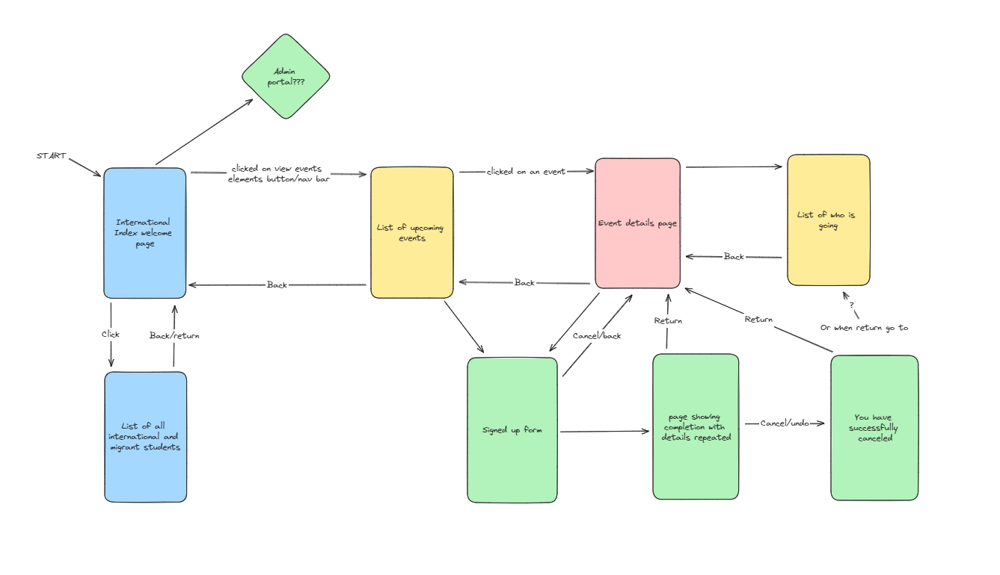

Problem I'm facing is to figure out how admin portal will work.
Also I have to figure out how the students can cancel/undo sign-ups without the risk of getting impersonated. I'm thinking of making the student enter their school password when they signed-up and undo but not sure if that's a good idea or not.

Database Version 1:
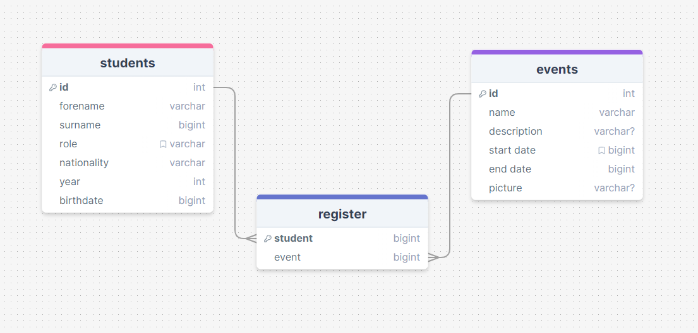
There's 2 and tables and 1 linking table to get data of signed up students. Have to check if the information of the student and event table are enough or too much.

I will need to get feedback from my end-user about both the flow and the DB. I also have to ask them of their preferred color pallete.

### 21/05/2024

I asked about how admin portal would looked like and added it to drawsql. I also change 'id' column of events table into 'code' as an events could repeat my times during school year. 

Database Version 2:
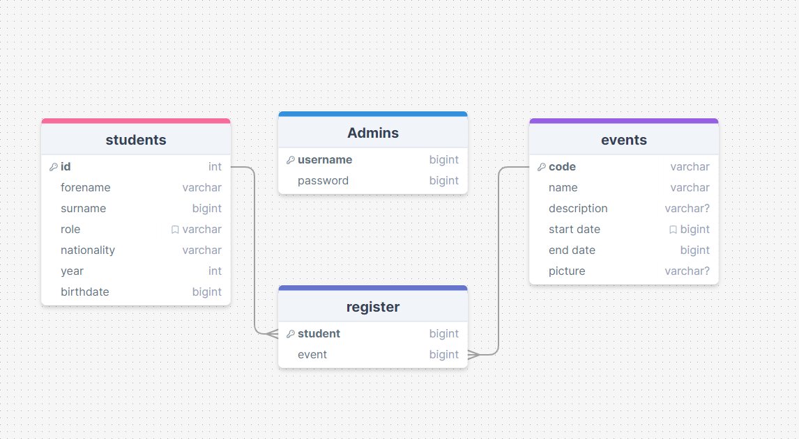

Added a table with admin username and password that will be used by international staffs and leaders.

### 23/05/2024

On the 21/05/2024 after school I have discussed with my client about the progress I have done so far and got some feedback.

My client said that it would be a good idea to add a page where a student could view all their sign ups and manage it there for easier usage. To do that and preventing impersonation we have decided that we should make the system have a log in function.
>Everyone should know their school password and it wouldn't be too hard to use eventhough they have to log in.

is what my client said.

> I think that a log in function would be very nice. However, one problem I can think of is that what if somehow a student haven't been register into the system then what will happen. I don't think it would be much of a problem though as I could add a form to register that will need admin approval before it can updated into the database. Otherwise the student could talk to international staff and we can add the student in.

My client have approved my database tables and also provided my with the color pallette that they would like the system. (add pic)

I would need to redesign my user flow to have sign-in function that will differ in the access within the system between students and admin.
### 27/05/24

I'm working on the new verstion of my user flow, however I have come across some confusing aspect of the system. My user suggest that I add a page that have a list of all the sign ups that a student have done. I'm just confused on what would happened when the sign up period ends..? would the sign up be gone from the 'My sign ups' page or would it be gray and uninteractable. If then when will the gray sign up be gone? Or perhaps I should add a section called passed events signups where it all go there after the event has ended? I would need to have a discussion with my end user.

User Flow Version 1:
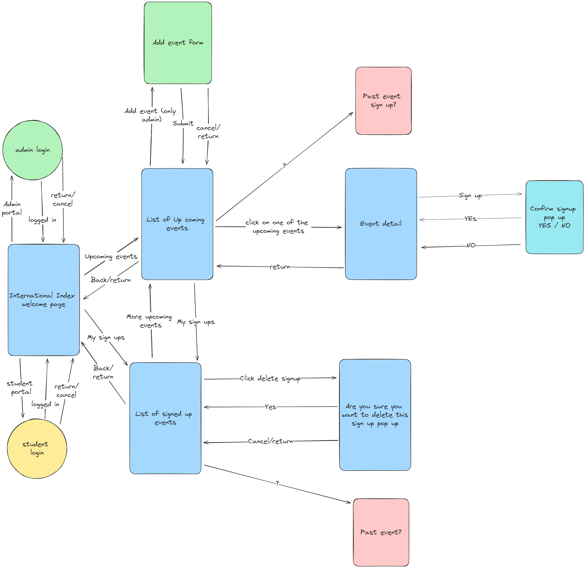

### 10/06/24

I had a conversation with MR.Copley about if my system would work for my level 2 course. We have come to the conclusion that the log-in system will be too complicated for my level 2 demo system, therefore I'll will be using a PIN as a security factor to prevent impersonation of students instead of a log-in system to keep it simple for my level 2 course. I would need to re-design my user flow diagram and database to match this PIN security system.

Here is my fixed flow design that have been approved by my end-user:
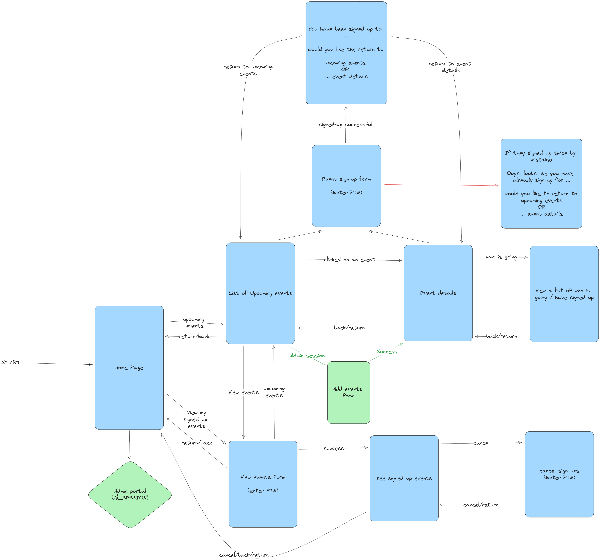

Here is my updated database including the use of PIN:
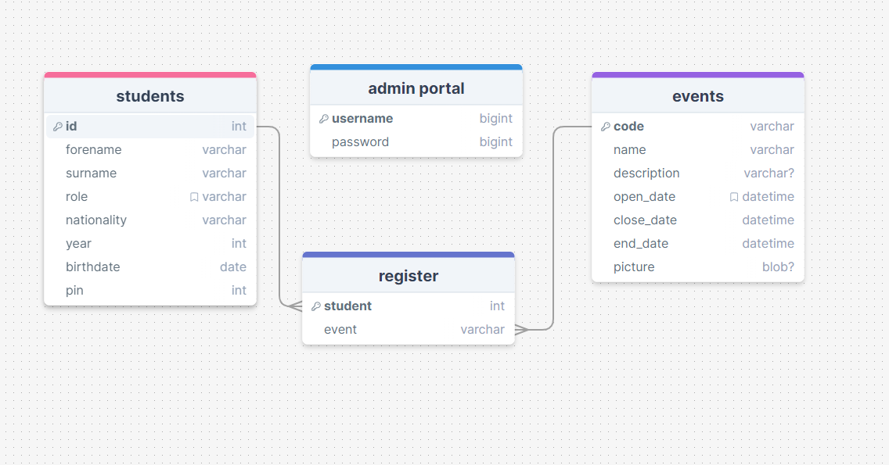
I added pin column in the student table.

Moving on to designing the interface, my user have stated that
>I would prefer the main use of the site to be on computers

meaning that I should focus on designing the interface on desktop frame, and aware of desktop site format (eg. website conventions).

### 13/06/24

I have finished my black and white user interface demo in Figma with interactions!

Here is what it looks like:
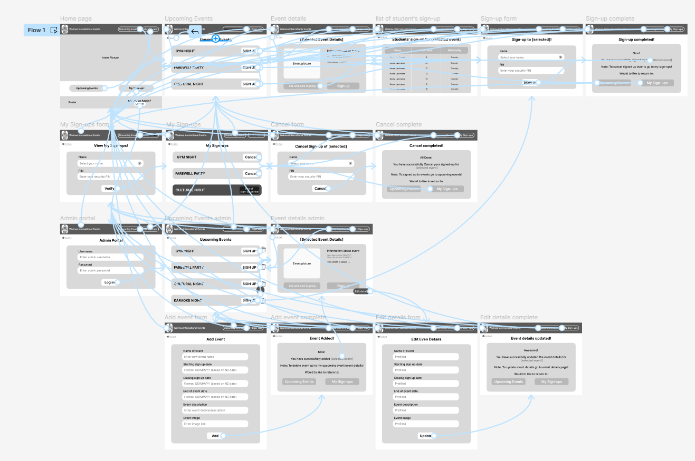

I have also finished setting up my database in AdminerEvo:
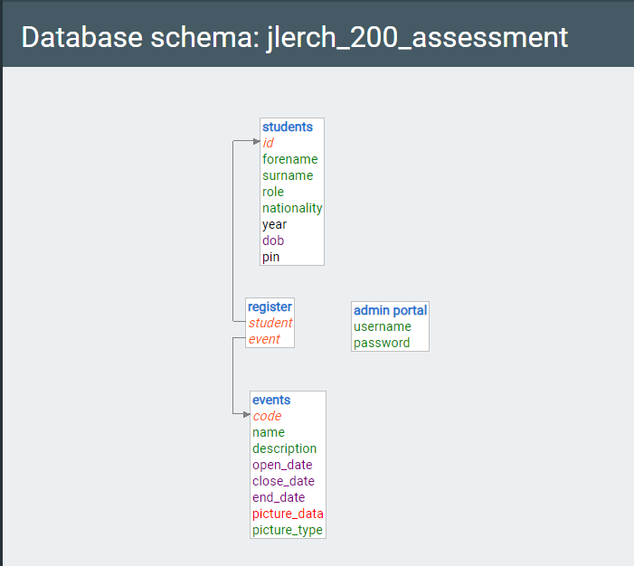

I will arrange a catch up with my end user to see if they like the feel of this user interface demo or not, before moving forward to choosing colors palette.

### 14/06/24

Today I had a talk with my end user about my UI demo if they are satisfied with the feeling and flow of the site. They approved that it look and feels really good when using. However, they now want me to add colors.

>I think for the colors we should do the Waimea green and yellow like in the Waimea College website.

So I have go to Realtime Colors site to use the eyedropper tool to get the exact Waimea website color palette. Also my end user have specify to me the fonts that they want me to use for my system.

>Could you use Times New Roman for the Waimea college home button on the navigation bar to match the Waimea College website? And for the normal text we usually use calibre, but the one that you have right now also looks really good.

Since Figma doesn't have those text accessible for me at the moment I'll be focusing on putting in the colors into my UI demo.

Here are 2 ideas for my UI demo layout colors:

1st:
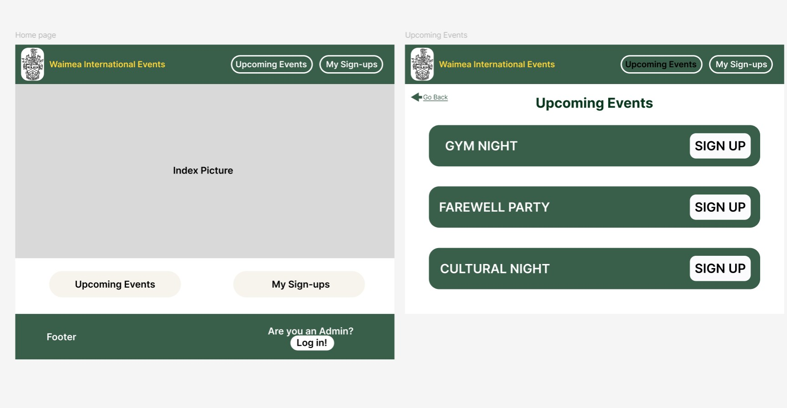

2nd:
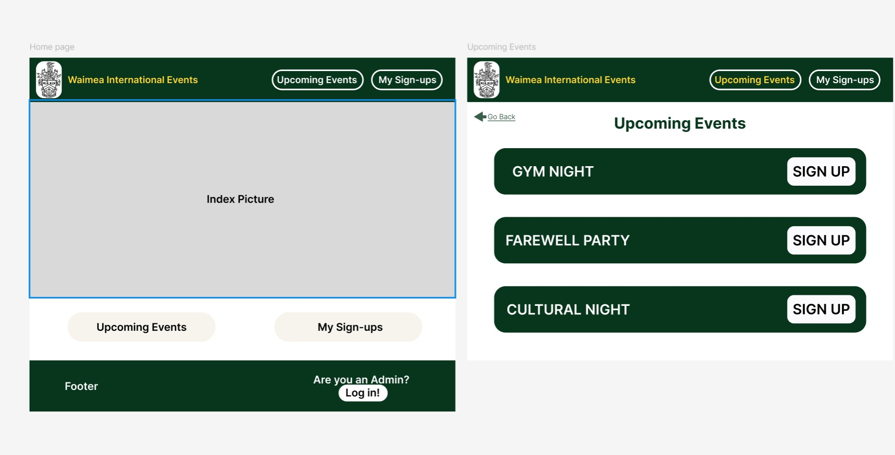

The difference between the two is the main green. 1st have a more lighter and pastel green while 2nd have a darker green. I would need to ask my end user what they prefer before proceeding to add colors to all remining frames.

### 27/06/24

I have finished working on the general functionality of the 
- index page
- upcoming event page
- event details page
- Who is going page
- signing up to event / adding to DB and checking for incorrect pin: all working

PICS!!!:

My end-user had also said that they prefer my 1st UI demo colors that had the lighter green:

I will need to work on the functionality of admin portals and my sign-ups before moving on the respondsive styling in css.

### 01/07/24

I have finished the functionality of 'mySignUps' pages 

- This is the functionality of the 'mySignUps' pages

PICS!!!!!!!

It is a page where student can cancel sign-up and view what they have signed-up for using $_SESSION 

I have to work on the admin portal.
When an admin is in session, they can see:
- the 'trash-can' icon that they can click on and delete event. 
- the plus icon to add upcoming events
- in the event details page there is an edit details button that let admin edit event details
- New page that let's admin view every international and migrants student records as well as add and delete student's record

Other than that I have to figure out how to add pictures into database when creating an upcoming event. Also, I have to figure out how to format the datetime so that it is easily readable by my end-users.

### 23/07/24

I have done some of the admin fuctionality such as:
-seeing the 'trash-can' icon and its deleting functionality with a error prevention by affirming if they are sure about deleting
-Plus icon and its adding functionality
-(I've also done a tiny bit of css)

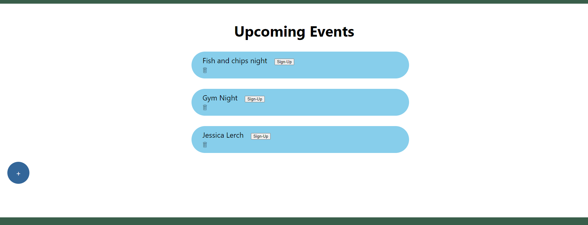

- This is the delete functionality once clicked on the delete icon:

1.
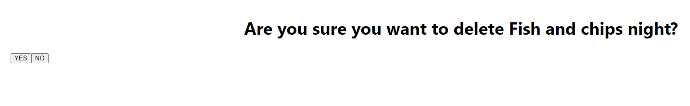

If click on yes the event is then deleted and vanish from the page

2.
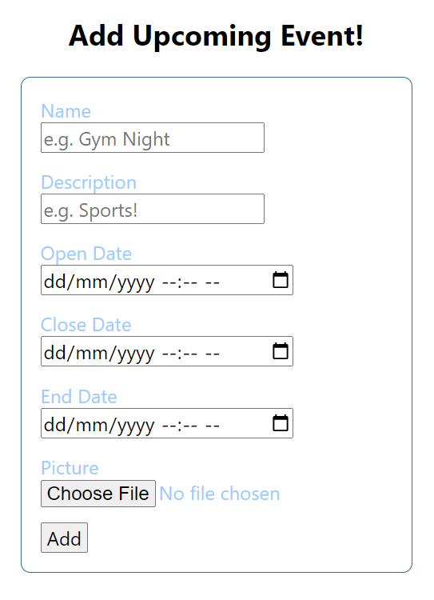

- This is the add functionality once clicked on the add icon:

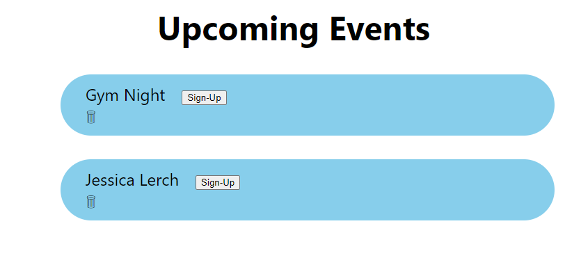

As a note to myself next i will have to figure out and work on the followings:

- edit event updating data into database especially picture file (??)

- if picture is null make a gray box instead

- formating datetime data to a more easily to read format

- responsive and good looking css.

- check when end-user if I'm going on the right track         

### DATE HERE

Replace this test with what you are working on

Replace this text with brief notes describing what you worked on, any decisions you made, any changes to designs, etc. Add screenshots / links to other media to illustrate your notes where necessary.         

### DATE HERE

Replace this test with what you are working on

Replace this text with brief notes describing what you worked on, any decisions you made, any changes to designs, etc. Add screenshots / links to other media to illustrate your notes where necessary.         