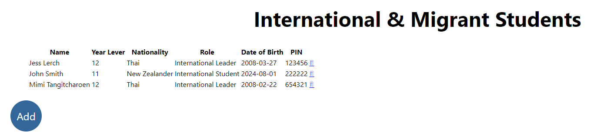
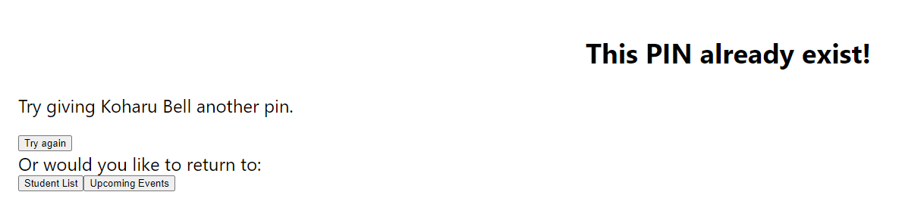

# Development of a Database-Linked Website for NCEA Level 2

Project Name: **International Events Register System**

Project Author: **Jess Lerch**

Assessment Standards: **91892** and **91893**

-------------------------------------------------

## Design, Development and Testing Log

### 20/05/2024

Worked on flow and database design

Flow Version 1:

Problem I'm facing is to figure out how admin portal will work.
Also I have to figure out how the students can cancel/undo sign-ups without the risk of getting impersonated. I'm thinking of making the student enter their school password when they signed-up and undo but not sure if that's a good idea or not.

Database Version 1:

There's 2 and tables and 1 linking table to get data of signed up students. Have to check if the information of the student and event table are enough or too much.

I will need to get feedback from my end-user about both the flow and the DB. I also have to ask them of their preferred color pallete.

### 21/05/2024

I asked about how admin portal would looked like and added it to drawsql. I also change 'id' column of events table into 'code' as an events could repeat my times during school year. 

Database Version 2:

Added a table with admin username and password that will be used by international staffs and leaders.

### 23/05/2024

On the 21/05/2024 after school I have discussed with my client about the progress I have done so far and got some feedback.

My client said that it would be a good idea to add a page where a student could view all their sign ups and manage it there for easier usage. To do that and preventing impersonation we have decided that we should make the system have a log in function.
>Everyone should know their school password and it wouldn't be too hard to use eventhough they have to log in.

is what my client said.

> I think that a log in function would be very nice. However, one problem I can think of is that what if somehow a student haven't been register into the system then what will happen. I don't think it would be much of a problem though as I could add a form to register that will need admin approval before it can updated into the database. Otherwise the student could talk to international staff and we can add the student in.

My client have approved my database tables and also provided my with the color pallette that they would like the system. (add pic)

I would need to redesign my user flow to have sign-in function that will differ in the access within the system between students and admin.
### 27/05/24

I'm working on the new version of my user flow, however I have come across some confusing aspect of the system. My user suggest that I add a page that have a list of all the sign ups that a student have done. I'm just confused on what would happened when the sign up period ends..? would the sign up be gone from the 'My sign ups' page or would it be gray and uninteractable. If then when will the gray sign up be gone? Or perhaps I should add a section called passed events signups where it all go there after the event has ended? I would need to have a discussion with my end user.

User Flow Version 1:

### 10/06/24

I had a conversation with MR.Copley about if my system would work for my level 2 course. We have come to the conclusion that the log-in system will be too complicated for my level 2 demo system, therefore I'll will be using a PIN as a security factor to prevent impersonation of students instead of a log-in system to keep it simple for my level 2 course. I would need to re-design my user flow diagram and database to match this PIN security system.

Here is my fixed flow design that have been approved by my end-user:

Here is my updated database including the use of PIN:

I added pin column in the student table.

Moving on to designing the interface, my user have stated that
>I would prefer the main use of the site to be on computers as in the future students will be required to bringe their devices to school.

meaning that I should focus on designing the interface on a desktop frame, and aware of desktop site format (eg. website conventions).

### 13/06/24

I have finished my black and white user interface demo in Figma with interactions!

Here is what it looks like:

[Click here to access the interactive figma page](https://www.figma.com/proto/exC58SeVDemDwwqeriYzBB/International-even-register-DTD-level-2-Assessment?node-id=18-2&node-type=CANVAS&t=OFuwStXqjfQrZYcx-1&scaling=scale-down&content-scaling=fixed&page-id=0%3A1&starting-point-node-id=18%3A2)

I have also finished setting up my database in AdminerEvo:

I will arrange a catch up with my end user to see if they like the feel of this user interface demo or not, before moving forward to choosing colors palette.

### 14/06/24

Today I had a talk with my end user about my UI demo if they are satisfied with the feeling and flow of the site. They approved that it look and feels really good when using. However, they now want me to add colors.

>I think for the colors we should do the Waimea green and yellow like in the Waimea College website.

So I have go to Realtime Colors site to use the eyedropper tool to get the exact Waimea website color palette. Also my end user have specify to me the fonts that they want me to use for my system.

>Could you use Times New Roman for the Waimea college home button on the navigation bar to match the Waimea College website? And for the normal text we usually use calibre, but the one that you have right now also looks really good.

Since Figma doesn't have those text accessible for me at the moment I'll be focusing on putting in the colors into my UI demo.

Here are 2 ideas for my UI demo layout colors:

1st:

2nd:

The difference between the two is the main green. 1st have a more lighter and pastel green while 2nd have a darker green. I would need to ask my end user what they prefer before proceeding to add colors to all remining frames.

### 27/06/24

I have finished working on the general functionality of the 
- index page
- upcoming event page
- event details page
- Who is going page
- signing up to event / adding to DB and checking for incorrect pin: all working

This clip will show you those finished functions!

[Click here to view my first update clip!](https://mywaimeaschool-my.sharepoint.com/:v:/g/personal/jlerch_waimea_school_nz/EZnKW1e1e8dHnSLck1qXcL0BRnLtgmIjQW19xyp17cg4eQ?e=6x3ici)

My end-user had also said that they prefer my 1st UI demo colors that had the lighter green:

I will need to work on the functionality of admin portals and my sign-ups before moving on the respondsive styling in css.

### 01/07/24

I have finished the functionality of 'mySignUps' pages 

- This is the functionality of the 'mySignUps' pages

[Click here to view my second update clip!](https://mywaimeaschool-my.sharepoint.com/:v:/g/personal/jlerch_waimea_school_nz/EZRRUYB7RsVHpZnYPZ2aTQEBtUhRrgUg1M5Yk8bzVIDcbg)

It is a page where student can cancel sign-up and view what they have signed-up for using $_SESSION 

I have to work on the admin portal.
When an admin is in session, they can see:
- the 'trash-can' icon that they can click on and delete event. 
- the plus icon to add upcoming events
- in the event details page there is an edit details button that let admin edit event details
- New page that let's admin view every international and migrants student records as well as add and delete student's record

Other than that I have to figure out how to add pictures into database when creating an upcoming event. Also, I have to figure out how to format the datetime so that it is easily readable by my end-users.

### 23/07/24

I have done some of the admin fuctionality such as:

- seeing the 'trash-can' icon and its deleting functionality with a error prevention by affirming if they are sure about deleting

- Plus icon and its adding functionality

- seeing the list of all student in the DB and their info aswell as a button to add new a student.

- (I've also done a tiny bit of css)

#### This is the delete functionality once clicked on the delete icon:

1.

If click on yes the event is then deleted and vanish from the page

2.

#### This is the add functionality once clicked on the add icon:

#### This is the student list page and adding new student form:

As a note to myself next i will have to figure out and work on the followings:

- edit event updating data into database especially picture file (??)

- if picture is null make a gray box instead

- formating datetime data to a more easily to read format

- responsive and good looking css.

- check with end-user if I'm going on the right track      

- check for repetitive pin when adding new student.

- how openDate, closeDate, endDate is going to work

### 25/07/24

As I was playing around the site I've notice a few problem with the 'mySignUps' function. Everytime I go out of the mySignUps page into other page and try to access back to mySignUps I kept having to verify myself over and over again. So it lead me to think that maybe I could make a processor page where it determind whether to foward to the verify page or straight to mySignUps page depening on if there is a set value in the mySignUps session. Or rather I could combine mySignUps form page and mySignUps page together and use if else function to determind which to show. (kind of the the delete button and add button for admin session) 

Also! I have completed the code for when there is no image in the DB display a gray box as a placeholder instead. Like this:

     

### 01/08/24

I have finished the functionality of editing the event details as an admin.

This is how it looks like when...
 
- there is no existing image:

- there is an exiting image:

After the update button had been clicked it foward the admin to the event detials page to see the changes.

I have also finished the functionality of the 'student list' page, allowing admin to add/delete new student with repetitive pin error prevention

This is how it currently looks like:

I will need to check with my end-user whether they want to change anything about these funtionalities I have completed. Also ask if they want a warning when clicking on the edit-detials button. Lastly, check if they want the navigation bar to be sticky, and icon for nav buttons or not.

ask about dates if they want dates for event or not...

### 08/08/24

I have talked to my end-uesr and catch up about every progress that I have made here are their comment:

>For the navigation title I want to have the word 'Waimea College' as a main heading to make the students feels like they belong in Waimea College, then put 'international events' as a sub-heading.

before:

after:

I would need to ask if they are happy with the 'International Events' being in yellow or another color.

after letting them play around with the site I asked them if there is anything that feels akward to use and they commented that:
>I think the only thing that will make it better is if we have a 'back' button to go back to the previous page

before:

after:

 - But I'm encountering a little problem with the back button when using 'history.back()'. For instance when student have succesfully sign-up and click on the back button it takes them back to the sign-up form which creates an awkward flow of usage.

discussions about '_date' data
>I want you to add a event date into the database so that people can easily see when does the event will be taking place.
I added event_date into the database and display it on the event

db change: 

display on upcoming  event list: 

display on event detail: 

delete in event detials page when in admin session

before: 

after: 

Also my end-user have praised that
> The forms are very easy to use, I like it.

### 14/08/24

I went to ask my end-user about the Waimea College 'International Event' color, if whether or not they like it being yellow.
>I think they Waimea College and International should be the same color.
Then I try changing it for her real-time via google chrome inspect and we came to the conclusion that both being white would be better.

Before: 

After: 

solution to back button problem: I just put my back button as an 'a href' link to the page that correspond with my site flow of usage rather than 'history.back()' to prevent akward usage.

I asked a few of my international friends from different cultural whether any thing is the site if offensive to them at all and they said that
> Everything looks good!

I also made my css respondsive enough to be use of phone so that everyone can easily access the site anywhere and anytime.

Here is me playing around my site in a respondsive mobile frame!

[Click here to view respondsive testing clip!](https://mywaimeaschool-my.sharepoint.com/:v:/g/personal/jlerch_waimea_school_nz/EVgzTFNd5eVDiDLB3rWY8YEBokTa5IwgjJzsa9rF6kqQlA)

### 18/8/24

#### Today is Validation day!!

I think have finish all the functionality to which my end-user have approved of liking how it feels when letting them play around with the site.

- I'm going to start of with the index page

Fixed:

- Upcoming-Events page

after commenting all the consolelogs, there is no bugs first-try, go me! :D

- Sign-up form 

fixed:

- Sign-up error page

fixed:

- Sign-up complete page

- Event-Details page

fixed:

- Who's else is going page

- My Sign-ups form

fixed:

- My Sign-ups error page

- My Sign-up page

- Cancel form

fixed:

- Cancel Error page

- Cancel complete page

- Admin form

- Student List page

fixed:

- Closed Events page

- Add Event form

- Edit Event form

- Add student form

- Add student error

- Delete confirmation page

### 23/08/24

#### REAL DATA TESTING EVIDENCE!

I'll be displaying clips of the testing of all key features using real data.

- Student POV:
  - Looking at upcoming events, event detials, list of who's going and signing up to an event

    [Click here to view testing clip](https://mywaimeaschool-my.sharepoint.com/:v:/g/personal/jlerch_waimea_school_nz/ER45JImixM9EqJXrbKtZ8XYBrW8hyDvOK9HZamg9nT_i7w)

  - accessing the MySignUps page to view their past signed-ups, as well as cancelling their signed-up event.
  
    [Click here to view testing clip](https://mywaimeaschool-my.sharepoint.com/:v:/g/personal/jlerch_waimea_school_nz/EQ2rkEdvW4NJmcRBRZnXl1kByiOBPUBJCMXTSSKXDXiDqg)

- Admin POV:
  - Accessing admin portal and verify

    [Click here to view testing clip](https://mywaimeaschool-my.sharepoint.com/:v:/g/personal/jlerch_waimea_school_nz/ETgTsDUsuUlDoL10C9ReqRYB3u_pg80JKkcickKOtzeIKg?e=MiQuvA&nav=eyJyZWZlcnJhbEluZm8iOnsicmVmZXJyYWxBcHAiOiJTdHJlYW1XZWJBcHAiLCJyZWZlcnJhbFZpZXciOiJTaGFyZURpYWxvZy1MaW5rIiwicmVmZXJyYWxBcHBQbGF0Zm9ybSI6IldlYiIsInJlZmVycmFsTW9kZSI6InZpZXcifX0%3D)

  - Add event

    [Click here to view testing clip](https://mywaimeaschool-my.sharepoint.com/:v:/g/personal/jlerch_waimea_school_nz/ES2VDmtdpCdPiW9jAJKFmW0BUEwjASMHcMhJDXqvk_01jA?e=iXX4sN&nav=eyJyZWZlcnJhbEluZm8iOnsicmVmZXJyYWxBcHAiOiJTdHJlYW1XZWJBcHAiLCJyZWZlcnJhbFZpZXciOiJTaGFyZURpYWxvZy1MaW5rIiwicmVmZXJyYWxBcHBQbGF0Zm9ybSI6IldlYiIsInJlZmVycmFsTW9kZSI6InZpZXcifX0%3D)

  - Edit event detials

    [Click here to view testing clip](https://mywaimeaschool-my.sharepoint.com/:v:/g/personal/jlerch_waimea_school_nz/ESYO5gBPl5pEnGHr-kOPGZABCDckHRH4ybh_sByOnFI8oA?e=z7gQWl&nav=eyJyZWZlcnJhbEluZm8iOnsicmVmZXJyYWxBcHAiOiJTdHJlYW1XZWJBcHAiLCJyZWZlcnJhbFZpZXciOiJTaGFyZURpYWxvZy1MaW5rIiwicmVmZXJyYWxBcHBQbGF0Zm9ybSI6IldlYiIsInJlZmVycmFsTW9kZSI6InZpZXcifX0%3D_)

  - Delete event

    [Click here to view testing clip](https://mywaimeaschool-my.sharepoint.com/:v:/g/personal/jlerch_waimea_school_nz/EcBg22mIeihJg0Em-szKbs4B-j_fEKqwbskVA0pj1uyj5A?e=6A5pFs&nav=eyJyZWZlcnJhbEluZm8iOnsicmVmZXJyYWxBcHAiOiJTdHJlYW1XZWJBcHAiLCJyZWZlcnJhbFZpZXciOiJTaGFyZURpYWxvZy1MaW5rIiwicmVmZXJyYWxBcHBQbGF0Zm9ybSI6IldlYiIsInJlZmVycmFsTW9kZSI6InZpZXcifX0%3D)

  - Closed event page

    [Click here to view testing clip](https://mywaimeaschool-my.sharepoint.com/:v:/g/personal/jlerch_waimea_school_nz/EVlYYO1gSuxAs8ILDez0udwBw_3YsFZs6qa7oRhcJ3KIWQ?e=Z4dahm&nav=eyJyZWZlcnJhbEluZm8iOnsicmVmZXJyYWxBcHAiOiJTdHJlYW1XZWJBcHAiLCJyZWZlcnJhbFZpZXciOiJTaGFyZURpYWxvZy1MaW5rIiwicmVmZXJyYWxBcHBQbGF0Zm9ybSI6IldlYiIsInJlZmVycmFsTW9kZSI6InZpZXcifX0%3D)

  - Student list page, add student + delete student 

    [Click here to view testing clip](https://mywaimeaschool-my.sharepoint.com/:v:/g/personal/jlerch_waimea_school_nz/Ed4WZuYUsyFIqm7WHH8K4eEBcy1hAb_XEmRorHXJnZIRpw?e=GVdsci&nav=eyJyZWZlcnJhbEluZm8iOnsicmVmZXJyYWxBcHAiOiJTdHJlYW1XZWJBcHAiLCJyZWZlcnJhbFZpZXciOiJTaGFyZURpYWxvZy1MaW5rIiwicmVmZXJyYWxBcHBQbGF0Zm9ybSI6IldlYiIsInJlZmVycmFsTW9kZSI6InZpZXcifX0%3D)

<!-- ### DATE HERE

Replace this test with what you are working on

Replace this text with brief notes describing what you worked on, any decisions you made, any changes to designs, etc. Add screenshots / links to other media to illustrate your notes where necessary. -->